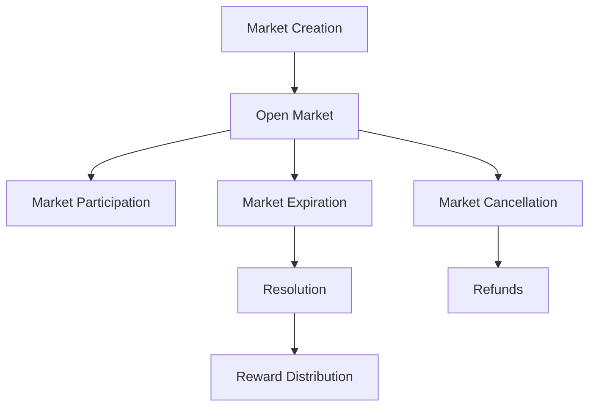

# TrendLink Prediction Platform

A decentralized prediction marketplace for emerging technologies and trends built on the Stacks blockchain.

## Overview

TrendLink enables users to create and participate in prediction markets focused on technological trends and innovations. The platform leverages collective intelligence to generate valuable predictive insights while rewarding accurate forecasters with STX tokens.

### Key Features
- Create prediction markets with customizable parameters
- Stake tokens on predicted outcomes
- Earn rewards for accurate predictions
- Build reputation through successful forecasting
- Transparent and tamper-proof resolution mechanism
- Automated reward distribution

## Architecture

The TrendLink platform is built around a core smart contract that manages the entire lifecycle of prediction markets.



### Core Components
- Market Management
- Stake Handling
- User Statistics
- Reward Distribution
- Platform Treasury

## Contract Documentation

### TrendLink Core Contract (`trendlink-core.clar`)

The main contract managing all platform functionality including market creation, participation, resolution, and reward distribution.

#### Key Data Structures
- `markets`: Stores prediction market details
- `market-stakes`: Tracks stakes per market outcome
- `user-stakes`: Records individual user participation
- `user-stats`: Maintains user performance metrics

#### Access Control
- Contract Owner: Can perform administrative functions
- Oracle: Can resolve markets
- Market Creator: Can cancel their markets under specific conditions
- Users: Can participate in markets and claim rewards

## Getting Started

### Prerequisites
- Clarinet
- Stacks wallet with STX tokens
- Node.js and npm (for development)

### Installation
1. Clone the repository
2. Install dependencies with `npm install`
3. Set up Clarinet environment

### Basic Usage

```clarity
;; Create a new market
(contract-call? .trendlink-core create-market 
    "Will AI surpass human intelligence by 2025?"
    "Prediction market for artificial general intelligence milestone"
    (list "Yes" "No")
    u144 ;; 24 hour expiration
    u1000000) ;; 1 STX stake

;; Participate in a market
(contract-call? .trendlink-core stake-on-outcome 
    u1 ;; market-id
    u0 ;; outcome-idx (Yes)
    u500000) ;; 0.5 STX stake
```

## Function Reference

### Market Creation and Management
```clarity
(create-market (question (string-ascii 256)) 
               (description (string-utf8 1024))
               (possible-outcomes (list 20 (string-ascii 64)))
               (expiration-blocks uint)
               (stake uint))

(expire-market (market-id uint))

(cancel-market (market-id uint))
```

### Market Participation
```clarity
(stake-on-outcome (market-id uint) 
                  (outcome-idx uint) 
                  (amount uint))

(claim-rewards (market-id uint))

(refund-from-cancelled-market (market-id uint) 
                             (outcome-idx uint))
```

### Administrative Functions
```clarity
(set-oracle (new-oracle principal))
(set-paused (paused bool))
(withdraw-fees (amount uint))
```

## Development

### Testing
Run the test suite:
```bash
clarinet test
```

### Local Development
1. Start Clarinet console:
```bash
clarinet console
```
2. Deploy contracts:
```clarity
(contract-call? .trendlink-core ...)
```

## Security Considerations

### Limitations
- Maximum 20 possible outcomes per market
- Minimum stake requirements for market creation and participation
- 24-hour dispute period after market resolution

### Best Practices
- Verify market status before participation
- Ensure sufficient STX balance for staking
- Double-check outcome selection before staking
- Wait for transaction confirmation before taking further actions
- Monitor market expiration times

### Platform Safeguards
- 5% platform fee for sustainability
- Market creator stake requirement
- Automated reward distribution
- Pause mechanism for emergencies
- Oracle-based resolution system